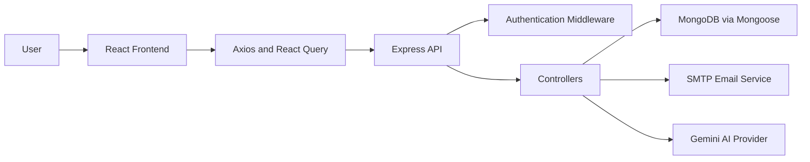
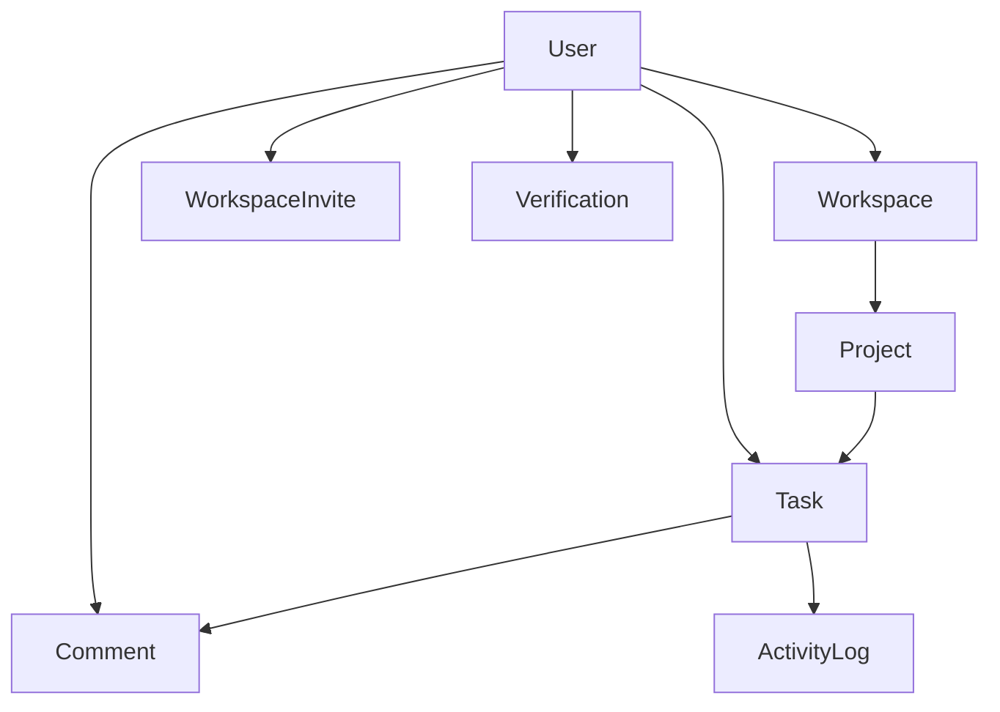

# TaskHub
## Full Stack Project Management System

## Abstract

TaskHub is a full-stack web-based project management system developed to support collaborative task planning, project tracking, workspace-based team organization, and AI-assisted productivity insights. The system enables users to create workspaces, invite members, manage projects, assign tasks, track progress, and generate summaries of work activity. The frontend is implemented using React, TypeScript, and Vite, while the backend is built with Node.js, Express, and MongoDB. The platform also integrates JWT-based authentication, email verification, password reset support, role-based authorization, and Gemini-powered AI summarization. The project demonstrates the practical application of modern full-stack development techniques to solve real collaboration and productivity challenges in a structured and scalable way.

## Introduction

In modern software teams and academic groups, task coordination is often spread across multiple tools, making it difficult to manage accountability, deadlines, and project visibility. A centralized project management platform helps users organize work systematically while improving team coordination and productivity. TaskHub is designed as such a platform, offering project and task tracking features together with role-based access control and dashboard analytics.

## Background

The increasing complexity of team-based work has created the need for digital systems that can track tasks, group work by project, assign responsibilities, and provide measurable insight into progress. Existing project management solutions are widely used, but building a custom implementation provides deeper understanding of system design, backend architecture, frontend interaction flows, database modeling, and user-centric access control.

## Motivation

The main motivation behind TaskHub was to create a practical and complete project management system that combines essential team collaboration features with a clean full-stack architecture. The project was also motivated by the need to:

- build a real-world end-to-end application
- understand API-driven frontend-backend integration
- implement authentication and authorization in a production-style pattern
- explore AI integration in a useful productivity scenario
- develop a project suitable for academic presentation and portfolio use

## Problem Statement

Teams and student groups frequently face difficulties in managing shared work because tasks, project progress, and member responsibilities are not tracked in a unified system. Existing solutions may be too complex, costly, or not suitable for experimentation and learning. Therefore, there is a need for a project management system that is collaborative, secure, modular, and easy to use while still supporting real-world software engineering concepts.

## Objectives

- Design and develop a centralized project management system
- Provide secure user authentication and role-based access control
- Enable workspace-based collaboration with multiple users
- Support project and task lifecycle management
- Present dashboards and insights for productivity monitoring
- Integrate AI-generated summaries for improved task understanding
- Demonstrate modular full-stack system design using current web technologies

## Scope of the Project

The scope of TaskHub includes user account management, workspace creation, project creation, task assignment, status tracking, comments, subtasks, watchers, profile management, AI summarization, and dashboard analytics. The system is intended for educational, portfolio, and prototype-level collaboration use. Advanced enterprise features such as large-scale file storage, organization-wide audit trails, deep notification pipelines, and real-time collaboration are not included in the current version.

## Project Significance

This project is significant because it combines core areas of software engineering into one unified system:

- frontend application development
- backend API architecture
- database schema design
- authentication and access control
- asynchronous client-server communication
- AI-assisted productivity analysis

TaskHub is therefore both a functional software product and a strong demonstration of practical full-stack engineering knowledge.

## Literature Review

## Overview

Project management applications have become essential in team environments because they help structure work, improve visibility, and coordinate deadlines. From simple to-do systems to complex enterprise platforms, these applications have evolved to include boards, analytics, collaborative editing, and automation. Recent systems also include AI-assisted features such as summary generation, prioritization, and workflow recommendations.

## Existing Systems

Popular project management systems include:

- Trello
- Jira
- Asana
- Notion
- Monday.com

These systems typically provide features like project boards, task assignment, team collaboration, reporting, and workflow configuration.

## Gaps in Existing Systems

Despite their strengths, existing systems have some limitations in the context of learning and lightweight collaboration:

- many are too feature-heavy for small teams or student groups
- advanced features are often locked behind paid plans
- enterprise-oriented workflows can reduce simplicity
- internal implementation details are hidden from learners
- AI functionality may be limited or not tailored to focused productivity reviews

## Need for a New Approach

TaskHub offers a new approach by balancing usability with architectural transparency. It captures the most relevant features of a project management system while remaining understandable, extensible, and suitable for academic analysis. It also introduces AI summarization as a focused support tool rather than a complex automation layer.

## Proposed System Overview

TaskHub is a workspace-driven project management platform where authenticated users can create or join workspaces, manage projects within those workspaces, and interact with tasks inside projects. Each layer of the system has a defined role structure, allowing permissions to be enforced appropriately. The system also provides dashboards and AI summaries to help users monitor progress and workload.

## Workflow of the Proposed TaskHub System

1. A new user registers with name, email, and password.
2. The backend sends an email verification link to the registered email.
3. After verification, the user logs in and receives a JWT token.
4. The authenticated user creates a workspace or accepts a workspace invitation.
5. Authorized members create projects within a workspace.
6. Project managers create tasks and assign them to project members.
7. Users update task details, status, comments, watchers, and subtasks based on permissions.
8. The dashboard displays project and task insights.
9. The AI summarizer generates productivity summaries for tasks, projects, or workspaces.

## System Components

The proposed system consists of the following major components:

- React frontend
- Express backend API
- MongoDB database
- JWT authentication mechanism
- email service integration
- AI summarization module

## System Architecture

TaskHub follows a layered client-server architecture:

- Presentation Layer: React frontend and UI components
- Application Layer: Express routes, controllers, and middleware
- Data Layer: MongoDB collections managed through Mongoose
- Integration Layer: SMTP email service and Gemini AI provider

## Architecture Diagram

## User Interface Flow

The frontend contains multiple route groups:

- public pages such as Home, About, and Features
- authentication pages such as Login, Signup, Verify Email, Forgot Password, and Reset Password
- dashboard pages such as Dashboard, Workspaces, Project Details, Task Details, My Tasks, AI Summarizer, and Settings
- user profile page

The user flow begins with authentication and moves into the dashboard area, where workspace selection drives project and task navigation.

## Backend Communication

The frontend communicates with the backend using Axios through a fixed API base URL. React Query manages asynchronous data fetching and cache invalidation. JWT tokens stored in local storage are attached to requests through an interceptor. The backend validates request bodies using Zod, applies role and permission checks in controllers, and performs database operations using Mongoose.

## Use Case Diagram

```mermaid
flowchart TD
    U[User] --> R[Register]
    U --> L[Login]
    U --> VP[View Profile]
    U --> CPW[Change Password]
    U --> CW[Create Workspace]
    U --> JW[Join Workspace]
    U --> VW[View Workspace]
    U --> VT[View My Tasks]
    U --> AS[Generate AI Summary]

    OA[Owner or Admin] --> IM[Invite Members]
    OA --> CPROJ[Create Project]

    PM[Project Manager] --> CTASK[Create Task]
    PM --> ATASK[Assign Task]
    PM --> UTP[Update Task Priority]

    C[Contributor] --> UTS[Update Task Status]
    C --> UTC[Update Task Content]
    C --> AC[Add Comment]
    C --> US[Update Subtasks]
```

## Module 1 – User Role Management and Authentication

### Objective

To provide secure identity management and controlled access to system resources.

### Module Description

This module manages user registration, login, email verification, password reset, and logout behavior. It also enforces route protection on the backend and maintains authenticated session state on the frontend. Role-based permissions are supported at workspace and project levels.

### Key Features

- signup and login
- password hashing with bcrypt
- JWT token generation and verification
- email verification workflow
- reset-password workflow
- protected API access
- workspace and project role-based access control

## Module 2 – Workspace and Collaboration Management

### Objective

To create a shared collaboration environment for multiple users.

### Module Description

This module allows users to create workspaces, update workspace details, invite members, and accept invitation tokens. Workspaces act as the top-level grouping of collaborative activity and determine which users can access projects and statistics within that space.

### Key Features

- create, update, and delete workspace
- invite users to a workspace
- accept invitation by token
- workspace member and role management
- workspace dashboard statistics

## Module 3 – Project and Task Lifecycle Management

### Objective

To support structured planning, execution, and tracking of work items.

### Module Description

This module manages projects and tasks. Projects belong to workspaces and include members, tags, dates, and status fields. Tasks belong to projects and support assignment, priority, comments, subtasks, watchers, and archive state. Task-related activity can be logged and reviewed.

### Key Features

- create and delete projects
- create and assign tasks
- update task title, description, status, and priority
- manage subtasks
- add task comments
- watch and archive tasks
- fetch user-specific tasks
- track task activity history

## Module 4 – Dashboard Analytics and AI Summarization

### Objective

To improve visibility into work progress and provide smart productivity insight.

### Module Description

This module combines dashboard analytics with AI-generated summaries. The dashboard displays statistics on tasks and projects, while the AI summarizer analyzes selected time ranges and returns insights, summaries, and recommendations. It is designed to help users quickly understand work trends and identify priorities.

### Key Features

- workspace statistics dashboard
- recent projects and upcoming tasks
- task trend and priority charts
- AI summaries for tasks, projects, and workspaces
- time-range based analysis
- summary request rate limiting

## Data Flow Summary

1. The user performs an action in the interface.
2. The frontend sends a request using Axios.
3. The backend authenticates the request.
4. Zod validates the input data.
5. The controller performs permission checks and business logic.
6. MongoDB is queried or updated through Mongoose.
7. The backend returns JSON data.
8. React Query refreshes the UI state.

## System Requirements

## Hardware Requirements

- 4 GB RAM or above
- Dual-core processor or higher
- Internet connection for package installation and AI API access
- Sufficient disk space for project dependencies and database

## Software Requirements

- Node.js
- npm
- MongoDB
- modern web browser
- code editor such as VS Code
- SMTP credentials for email features
- Gemini API key for AI summarization

## Implementation

TaskHub is implemented as a modular full-stack application. The system separates user interface concerns from backend logic and stores application data in MongoDB. Controllers are used to keep business logic centralized, while route files organize API endpoints cleanly.

## Backend Implementation

The backend is built using Node.js and Express. The server is initialized in `backend/index.js`, where middleware for JSON parsing, logging, CORS, and routing is configured. MongoDB connectivity is handled through Mongoose. Route files map endpoint groups such as authentication, users, workspaces, projects, tasks, and AI summarization.

Backend implementation areas include:

- request routing
- middleware-based authentication
- schema validation with Zod
- workspace and project permission enforcement
- controller-driven CRUD operations
- AI provider integration
- email sending for verification and reset flows

## Frontend Implementation

The frontend is built using React, TypeScript, and Vite. Routing is managed using React Router, while server data is managed using React Query. The application uses reusable components for forms, dialogs, selectors, and dashboard views. Authentication state is stored in local storage and synchronized with route access through the auth context.

Frontend implementation areas include:

- route-based layouts
- auth-aware navigation
- workspace and project pages
- task management views
- settings and profile pages
- AI summary UI
- chart and dashboard rendering

## Database Design

The database uses MongoDB collections represented through Mongoose schemas. The major relationships are:

- one user can belong to multiple workspaces
- one workspace can contain multiple projects
- one project can contain multiple tasks
- one task can contain multiple comments and subtasks
- one user can be assigned to multiple tasks

## ER Diagram

## AI and Knowledge Processing Layer

TaskHub does not implement a chatbot-style conversational NLP system. Instead, it includes an AI summarization layer that analyzes tasks, projects, and workspace activity. The backend formats relevant data into prompts and sends them to the Gemini API. The returned text is then parsed into summary text, key insights, and recommendations, which are displayed in the frontend.

## Security and Access Control

Security is implemented through the following mechanisms:

- bcrypt password hashing
- JWT token authentication
- protected routes with middleware
- email verification before access completion
- role-based access control in workspaces and projects
- Zod request validation
- CORS configuration for frontend origin control

The codebase also includes Arcjet configuration for request protection, although some related checks are not fully enabled in the current implementation.

## Testing

## Testing Strategy

The project was reviewed through functional testing of major user flows. Since automated tests are not yet configured in the repository, testing focuses on endpoint behavior, UI actions, navigation flow, and permission enforcement.

## Test Areas

- user registration and login
- email verification and reset-password flow
- workspace creation and retrieval
- project creation and deletion
- task creation and update actions
- comment and subtask actions
- AI summary generation
- settings and profile update flows
- authorization failures on restricted actions

## Expected Results

- valid users should be able to register, verify, and log in
- only authorized roles should perform restricted actions
- workspace, project, and task views should load correct data
- AI summary responses should return readable insight data
- dashboard statistics should reflect user-visible workspace data

## Results and Discussion

The developed system successfully supports the intended collaboration workflow. Authentication, workspace management, project-task hierarchy, and role-based operations are all present in the current implementation. The dashboard and AI summarizer add value beyond standard CRUD operations by offering insight into productivity and workload patterns. The project also demonstrates good modular separation between frontend, backend, and data layers.

## Code Implementation and Output Screenshots

This section can be expanded with screenshots from the running application and API responses.

Suggested screenshots:

- home page
- login page
- signup page
- email verification page
- dashboard view
- workspace details page
- project details page
- task details page
- AI summarizer page
- settings page

Suggested code references:

- [frontend/src/routes/index.tsx](/home/rgutkrkvalley/Desktop/ProjectManagement/frontend/src/routes/index.tsx)
- [frontend/src/hooks/use-workspace.ts](/home/rgutkrkvalley/Desktop/ProjectManagement/frontend/src/hooks/use-workspace.ts)
- [frontend/src/hooks/use-task.ts](/home/rgutkrkvalley/Desktop/ProjectManagement/frontend/src/hooks/use-task.ts)
- [frontend/src/layouts/pages/dashboard/settings.tsx](/home/rgutkrkvalley/Desktop/ProjectManagement/frontend/src/layouts/pages/dashboard/settings.tsx)
- [backend/index.js](/home/rgutkrkvalley/Desktop/ProjectManagement/backend/index.js)
- [backend/middleware/auth-middleware.js](/home/rgutkrkvalley/Desktop/ProjectManagement/backend/middleware/auth-middleware.js)
- [backend/routes/workspace.js](/home/rgutkrkvalley/Desktop/ProjectManagement/backend/routes/workspace.js)
- [backend/controllers/auth-controller.js](/home/rgutkrkvalley/Desktop/ProjectManagement/backend/controllers/auth-controller.js)
- [backend/controllers/workspace.js](/home/rgutkrkvalley/Desktop/ProjectManagement/backend/controllers/workspace.js)
- [backend/controllers/task.js](/home/rgutkrkvalley/Desktop/ProjectManagement/backend/controllers/task.js)
- [backend/controllers/ai-summarizer.js](/home/rgutkrkvalley/Desktop/ProjectManagement/backend/controllers/ai-summarizer.js)

## Limitations

- no automated test suite is currently configured
- AI request rate limiting is stored in memory and resets on server restart
- file upload support is not yet fully implemented
- some UI and controller naming can still be polished
- notification and real-time collaboration features are not included

## Future Enhancements

- add unit and integration testing
- implement real-time task updates
- add notifications for assignment and comments
- add persistent AI usage tracking
- support attachment uploads with cloud storage
- improve analytics depth and reporting options
- add admin-level workspace governance tools
- improve UI responsiveness and accessibility

## Conclusion

TaskHub successfully fulfills the goal of creating a secure, modular, and collaborative project management system using modern full-stack technologies. The project demonstrates strong integration between frontend and backend layers, practical database modeling, role-based access control, and meaningful AI support. It is suitable as a college project because it combines technical depth with real-world usability and provides a strong base for future extension.

## References

- React Documentation
- Vite Documentation
- React Router Documentation
- TanStack React Query Documentation
- Tailwind CSS Documentation
- Express.js Documentation
- MongoDB Documentation
- Mongoose Documentation
- Zod Documentation
- Nodemailer Documentation
- Google Gemini API Documentation
